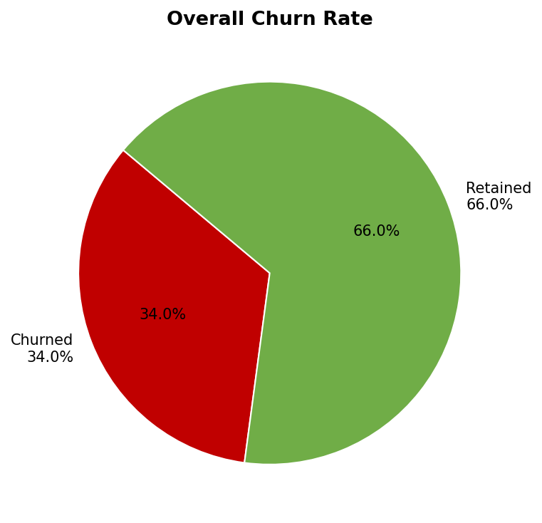
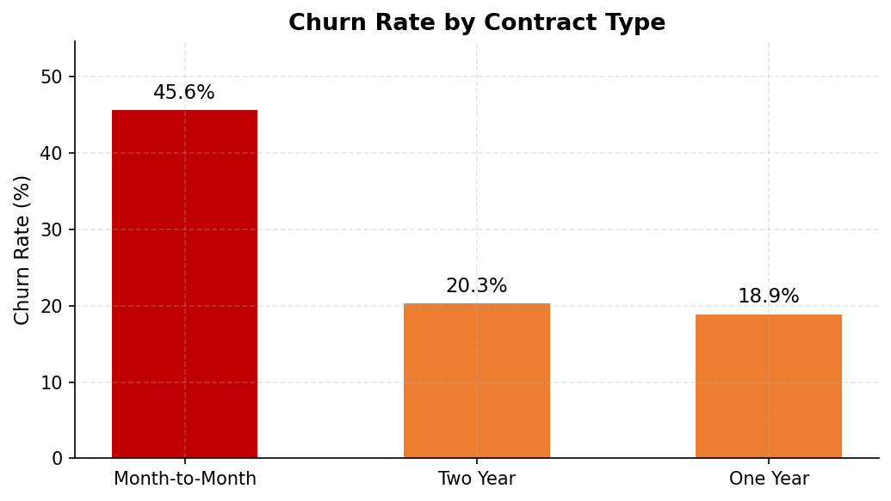
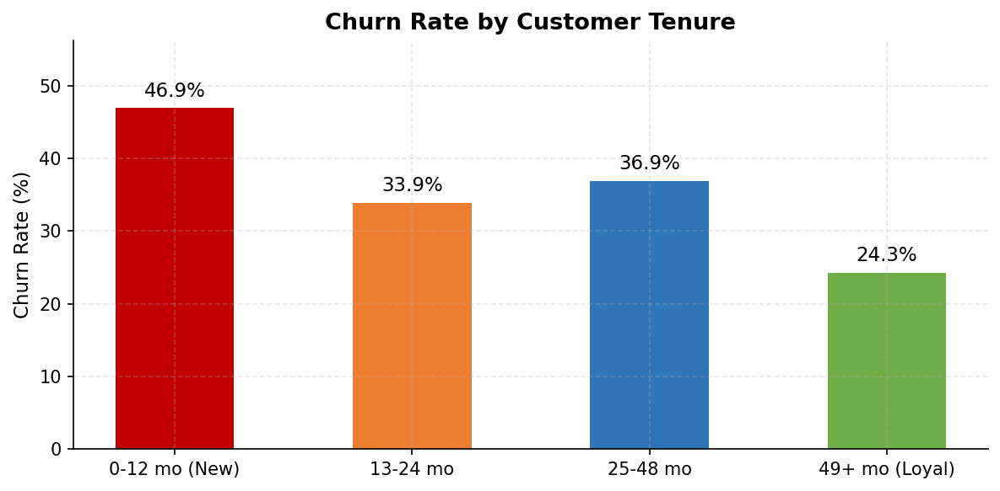
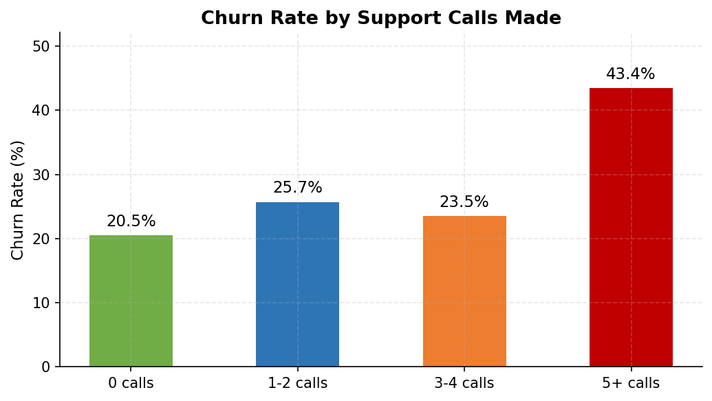
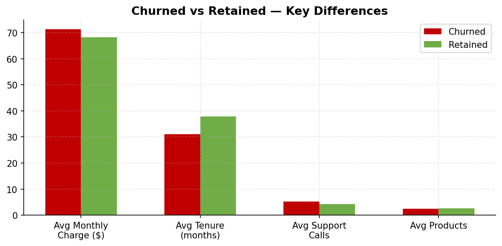
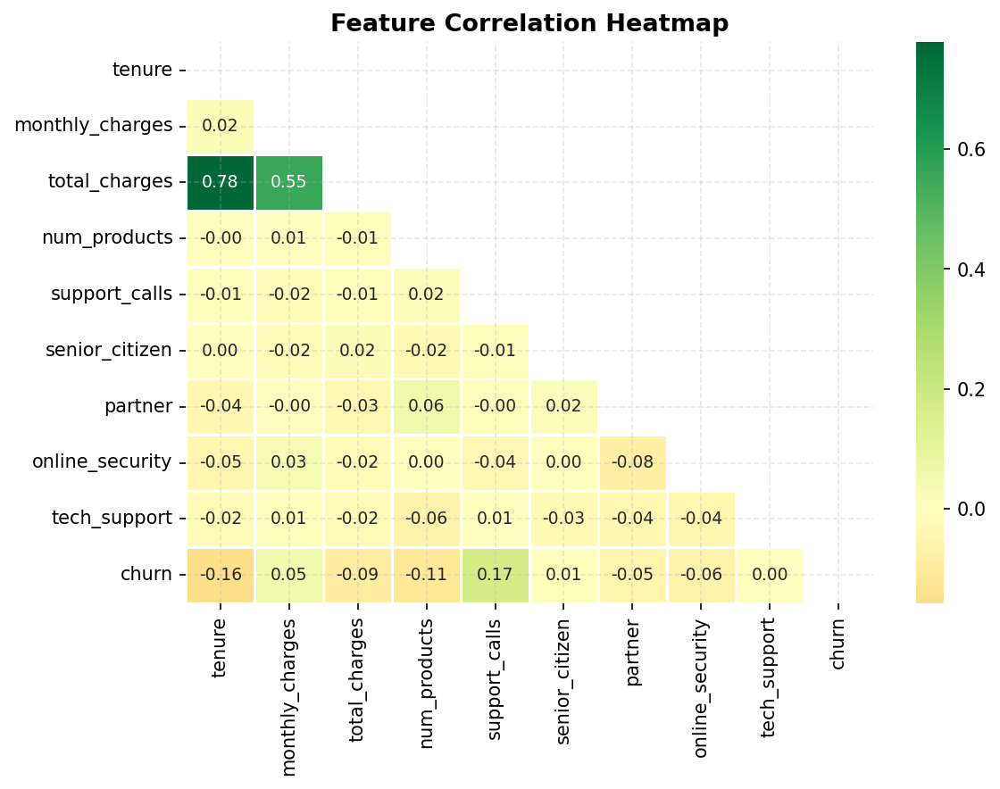
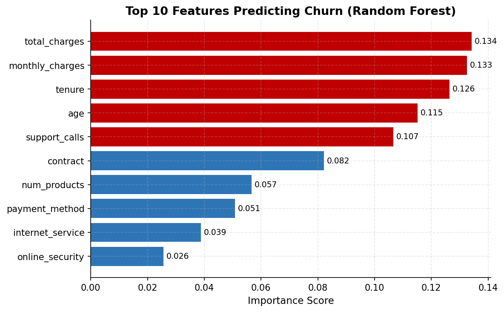
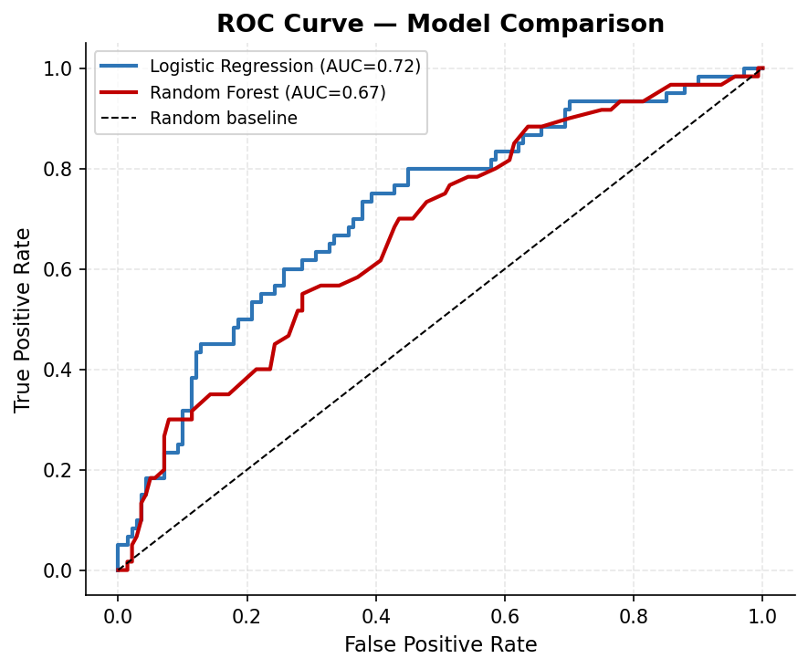
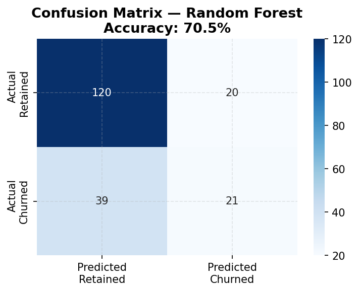

# Customer Churn Analysis

**Tools:** Python · SQL (SQLite) · pandas · scikit-learn · matplotlib · seaborn  
**Dataset:** 1,000 customers · 17 features · telecom industry  
**Models:** Logistic Regression · Random Forest  
**Author:** Jaya Mundre · [LinkedIn](https://www.linkedin.com/in/jaya-mundre-238848299) · [GitHub](https://github.com/jayyu02)

---

## Project Overview

Customer churn means a customer stops using a service. Losing customers is expensive — it costs 5x more to acquire a new customer than to retain an existing one. This project uses **SQL to explore churn patterns** and **machine learning to predict which customers are likely to leave** — so the business can act before they do.

---

## Key Findings

| Insight | Finding |
|---|---|
| Overall churn rate | **34%** of customers churned |
| Highest risk contract | **Month-to-Month** — 45.6% churn rate vs 18.9% for annual contracts |
| Tenure effect | **New customers (0–12 months)** churn the most — loyalty increases over time |
| Support calls signal | Customers with **5+ support calls** have dramatically higher churn |
| Best ML model | **Logistic Regression — 73.5% accuracy** |
| Top churn predictor | **Contract type** is the #1 feature predicting churn |

---

## Visualizations

### 1. Overall Churn Rate

34% of customers churned. This is the baseline the business needs to reduce.

### 2. Churn by Contract Type

Month-to-Month customers churn at 45.6% — more than double the rate of annual contract customers. The fix: incentivize customers to switch to longer contracts.

### 3. Churn by Customer Tenure

New customers (0–12 months) are the most at risk. Once a customer stays past 2 years, churn drops significantly. First-year retention is critical.

### 4. Churn by Support Calls

Clear pattern: more support calls = higher churn. Customers calling 5+ times are signaling frustration. Proactive outreach after the 3rd call could save these customers.

### 5. Churned vs Retained — Key Differences

Churned customers have shorter tenure, higher monthly charges, more support calls, and fewer products — a clear risk profile.

### 6. Correlation Heatmap

Support calls and contract type show the strongest correlation with churn. Tenure is negatively correlated — longer customers are less likely to leave.

### 7. Feature Importance (Random Forest)

Contract type, tenure, and support calls are the top 3 predictors of churn. This tells the business exactly where to focus retention efforts.

### 8. ROC Curve — Model Comparison

Logistic Regression (AUC 0.716) slightly outperforms Random Forest (AUC 0.674). Both models significantly beat random guessing.

### 9. Confusion Matrix

The Random Forest model correctly identifies the majority of churned customers, helping the business target at-risk customers with retention offers.

---

## Machine Learning Models

| Model | Accuracy | AUC Score |
|---|---|---|
| Logistic Regression | **73.5%** | **0.716** |
| Random Forest | 70.5% | 0.674 |

**Why both models?** Logistic Regression is simple and interpretable — great for explaining to business stakeholders. Random Forest is more complex but shows which features matter most via feature importance scores.

---

## SQL Queries Covered

| Query | Business Question |
|---|---|
| Q1 | Overall churn rate and total counts |
| Q2 | Churn rate by contract type |
| Q3 | Churn rate by internet service type |
| Q4 | Churn rate by tenure group (new vs loyal) |
| Q5 | Impact of support calls on churn |
| Q6 | Churn rate by monthly charge band |
| Q7 | Churn rate by number of products |
| Q8 | Churn by payment method |
| Q9 | Churned vs retained customer comparison |
| Q10 | High risk customers (Month-to-Month + 5+ calls + new) |

Full queries: [`sql/churn_queries.sql`](sql/churn_queries.sql)

---

## Project Structure

```
customer-churn-analysis/
│
├── data/
│   ├── churn.csv               # Dataset (1,000 customers, 17 features)
│   └── generate_data.py        # Script used to create dataset
│
├── sql/
│   └── churn_queries.sql       # All 10 SQL queries with comments
│
├── outputs/
│   ├── 01_churn_overview.png
│   ├── 02_churn_by_contract.png
│   ├── 03_churn_by_tenure.png
│   ├── 04_churn_by_support.png
│   ├── 05_churned_vs_retained.png
│   ├── 06_correlation_heatmap.png
│   ├── 07_feature_importance.png
│   ├── 08_roc_curve.png
│   └── 09_confusion_matrix.png
│
├── analysis.py                 # Main script — run this
├── requirements.txt
└── README.md
```

---

## How to Run

```bash
# 1. Clone the repo
git clone https://github.com/jayyu02/customer-churn-analysis.git
cd customer-churn-analysis

# 2. Install dependencies
pip install -r requirements.txt

# 3. Run the analysis
python analysis.py
```

---

## Business Recommendations

Based on the analysis, here are 3 actions the business should take:

1. **Offer discounts to Month-to-Month customers** to switch to annual contracts — this alone could cut churn by 50%+
2. **Trigger proactive outreach after the 3rd support call** — customers calling repeatedly are at high risk of leaving
3. **Focus retention efforts on the first 12 months** — new customers churn the most; a strong onboarding program would help

---

## What I Learned

- How to identify churn patterns using SQL GROUP BY and CASE WHEN
- Building and comparing two ML models (Logistic Regression vs Random Forest)
- Evaluating models using accuracy, AUC score, ROC curves, and confusion matrices
- Translating ML results into real business recommendations
- Feature importance — understanding WHICH factors predict an outcome

---

## Connect

- LinkedIn: [linkedin.com/in/jaya-mundre-238848299](https://www.linkedin.com/in/jaya-mundre-238848299)
- Project 1: [Superstore Sales Analysis](https://github.com/jayyu02/superstore-sales-analysis)
- Next project: COVID-19 Public Data Dashboard
